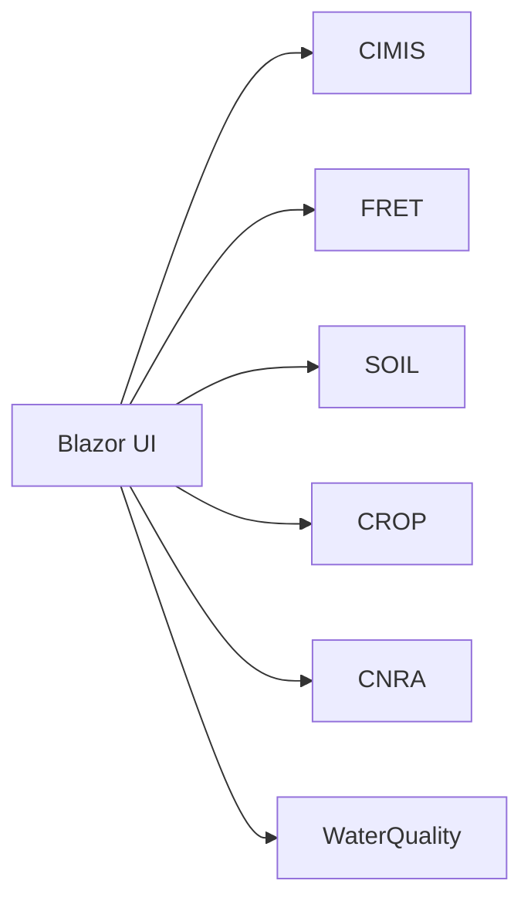

# Fan-out and Aggregation: The Gateway as a Composer

## The shape of the problem

Agronomy Studio is a Blazor WebAssembly app that needs data from many independent sources: weather (CIMIS), evapotranspiration (FRET), soil surveys, crop coefficients, water-rights data (CNRA), and water quality. Each of these is a separate **domain microservice** — a small TypeScript module with its own data shape, latency, and failure behavior.

A naive frontend would call all of them directly:



That works for one page. It rots quickly: the browser holds six base URLs, six auth schemes, six retry policies, and six ways to fail. Every screen re-implements the same orchestration.

## One composer, many sources

Agronomy Studio instead exposes a **single gateway** at `/agronomy-api/*`. The UI talks to exactly two surfaces — the gateway and a mock AI search — and nothing else. The gateway's job is *composition*: it fans out to the domain services, waits for their answers, and assembles one coherent response.

```ts
// netlify/lib/gateway.ts (sketch)
import { getWeather } from './cimis';
import { getEt } from './fret';
import { getSoil } from './soil';

export async function fieldSummary(lat: number, lon: number) {
  const [weather, et, soil] = await Promise.all([
    getWeather(lat, lon),
    getEt(lat, lon),
    getSoil(lat, lon),
  ]);
  return { weather, et, soil }; // one document, three sources
}
```

The key idea is that **composition lives in one place**. `Promise.all` runs the three calls concurrently, so the client pays the latency of the *slowest* service, not the sum of all three. The browser sees a single round trip.

## Why composition belongs server-side

Three concrete payoffs:

- **Latency**: a server-to-server fan-out inside one datacenter region is far cheaper than six trans-continental round trips from a laptop on coffee-shop WiFi.
- **Shaping**: the gateway returns exactly the fields a view needs. The UI does not need to know that soil data is paginated or that FRET returns metric units.
- **Stable contract**: the UI depends on `fieldSummary`, not on six third-party schemas that change independently.

## The trade-off you are accepting

A composer is a new component that can itself fail or become a bottleneck. You are trading *many simple dependencies in the client* for *one richer dependency on the server*. That is usually the right trade — but only if the gateway handles partial failure deliberately, which is the subject of a later lesson.
