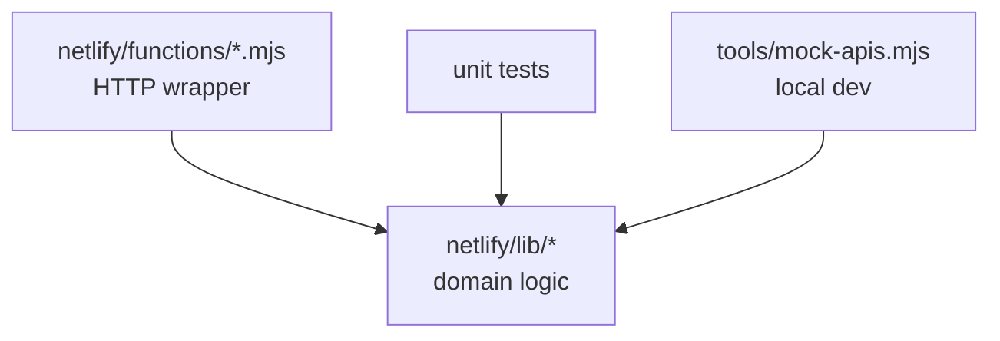

# Domain Modules vs. Function Wrappers

## Two folders, two responsibilities

Agronomy Studio splits its backend into two layers:

- `netlify/lib/*` — the **domain modules**: `cimis`, `fret`, `soil`, `crop`, `cnra`, `waterquality`, `gateway`, `ai-search`. These hold the actual logic.
- `netlify/functions/*` — the **thin wrappers** that expose a module as an HTTP endpoint Netlify can deploy.

The wrapper is deliberately boring:

```ts
// netlify/functions/agronomy-api.mjs
import { handleGateway } from '../lib/gateway.js';

export default async (request) => {
  const url = new URL(request.url);
  // parse query, call the real logic, format the HTTP response
  const result = await handleGateway(url);
  return new Response(JSON.stringify(result), {
    status: 200,
    headers: { 'content-type': 'application/json' },
  });
};
```

The wrapper knows about `Request` and `Response`. It does **not** know how soil data is fetched or how evapotranspiration is computed. That knowledge lives in `lib/`.

## Why the separation pays off

This is **inversion of control** applied to deployment. The logic does not depend on the deployment host; the deployment host depends on the logic.



Concretely you gain:

- **Testability**: `npm test` exercises `lib/` functions as plain TypeScript. There is no need to spin up an HTTP server or mock the Netlify runtime to test how `fret` computes ET. You call `getEt(lat, lon)` and assert on the return value.
- **Reuse**: the same `gateway` module is driven by `tools/mock-apis.mjs` in local development and by a Netlify function in production. Only the wrapper differs.
- **Portability**: if the team ever moves off Netlify, the wrappers are rewritten and `lib/` is untouched.

## A smell to avoid

When business logic leaks into the wrapper, the separation collapses. If `agronomy-api.mjs` started parsing soil CSVs or calling the CIMIS API directly, you could no longer test that behavior without an HTTP harness, and you could no longer reuse it from the mock server. Keep the wrapper thin: parse the request, call one library function, format the response.

## Type safety as a contract

Because the modules are TypeScript, `npm run typecheck` enforces the contract between the gateway and each domain module at build time. If `soil.getSoil` changes its return shape, the gateway fails to compile before anything is deployed.
