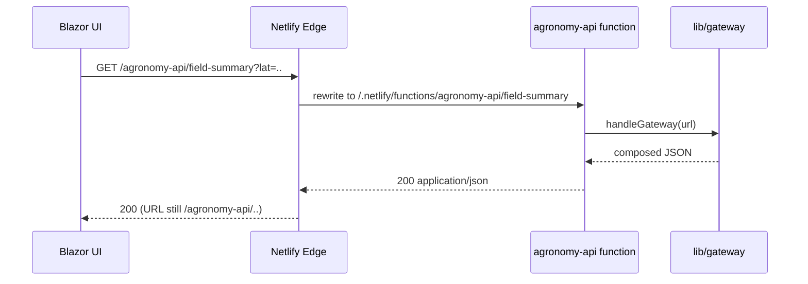

# Redirects as Routing: From URL to Function

## The request's full journey

When the Blazor app fetches `/agronomy-api/field-summary?lat=36.7&lon=-119.8`, how does that reach a TypeScript function? The answer is a redirect rule in `netlify.toml`.

```toml
# netlify.toml
[[redirects]]
  from = "/agronomy-api/*"
  to = "/.netlify/functions/agronomy-api/:splat"
  status = 200
```

The `status = 200` is the important detail. This is a **rewrite**, not a browser redirect. The client never sees `/.netlify/functions/...`; it asked for `/agronomy-api/...` and gets a 200 back from that same URL. The rewrite happens inside Netlify's edge, transparently.

## Reading the rule

- `from = "/agronomy-api/*"` — the public path the UI calls. The `*` is a wildcard.
- `:splat` — whatever the `*` matched. So `/agronomy-api/field-summary` rewrites to `/.netlify/functions/agronomy-api/field-summary`.
- The function then inspects its own path and query string to decide what to do.

## End-to-end



## Why route this way

The redirect is itself an application of the **one front door** idea, expressed in configuration instead of code:

- The public surface (`/agronomy-api/*`) is stable and pretty. It does not leak the `/.netlify/functions/` implementation detail.
- CORS mostly disappears: from the browser's view, the API lives at the same origin as the app, so there is no cross-origin request to the gateway.
- You can swap the backing function without changing a single client URL — just edit the `to` target.

## Local development parity

In local dev there is no Netlify edge, so `tools/mock-apis.mjs` plays the same routing role: it listens for `/agronomy-api/*` and dispatches to the same `lib/` modules. The contract the UI depends on — *call this path, get this JSON* — is identical in both environments. That parity is what keeps "works on my machine" honest.
