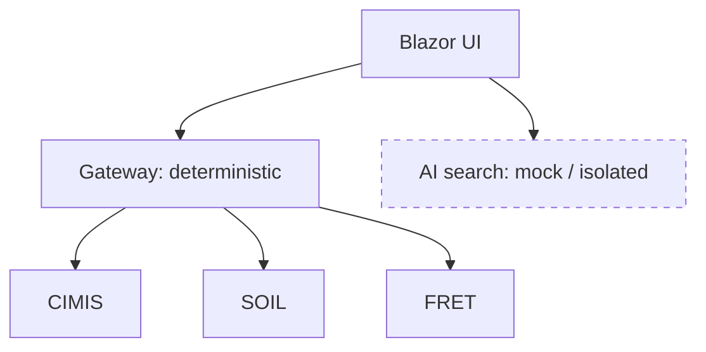

# Determinism at the Boundary: Where AI Belongs

## Two surfaces, one of them is special

The Agronomy Studio frontend talks to exactly two things: the gateway and a **mock AI search**. The AI search is intentionally outside the gateway and intentionally a deterministic mock — the LLM calls are stubbed.

That is not laziness. It is an architectural choice: keep nondeterministic, probabilistic behavior *out* of the deterministic compute path.

## What "deterministic" buys you

The domain services and the gateway are deterministic: given the same inputs, they return the same outputs. That property is what makes the system **testable** and its results **trustworthy**.

```ts
// netlify/lib/ai-search.ts (mock)
export function aiSearch(query: string) {
  // deterministic: a fixed query always yields the same ranked results
  const corpus = loadStaticCorpus();
  return rankByKeyword(corpus, query);
}
```

Because this is deterministic, `npm test` can assert exact results. A real LLM call would make the same test flaky: the same prompt can return different phrasing, ordering, or hallucinated fields on different runs. By stubbing the model, the *contract* of the search endpoint stays stable while the intelligence behind it can be swapped later.

## Why AI sits outside the core path

Consider what would break if an LLM lived inside `fieldSummary`:

- **Reproducibility**: a recommendation that changes between identical requests is impossible to audit. In agronomy, that can mean different irrigation advice for the same field on the same day.
- **Latency and cost**: model calls are slow and metered. Putting one on the critical path makes every field summary slow and expensive.
- **Failure mode**: an LLM can fail by *confidently returning wrong data*, which is far harder to detect than a service returning a 500.

Keeping AI on a separate surface means the deterministic core can be verified independently, and the AI feature can fail or be disabled without taking down the data the app actually depends on.



## The general principle

Draw a hard line between the part of your system that must be *correct and reproducible* and the part that is *helpful but probabilistic*. Let the deterministic core stand on its own — fully testable, with `npm test` and `npm run typecheck` as gates. Treat AI as an enhancement at the boundary that you can stub, swap, or remove without destabilizing the foundation.

When you eventually wire in a real model, it slots into the existing `ai-search` surface. The tests for the deterministic core never change, and the trust you have in field summaries, soil data, and water quality is never put at the mercy of a sampling temperature.
