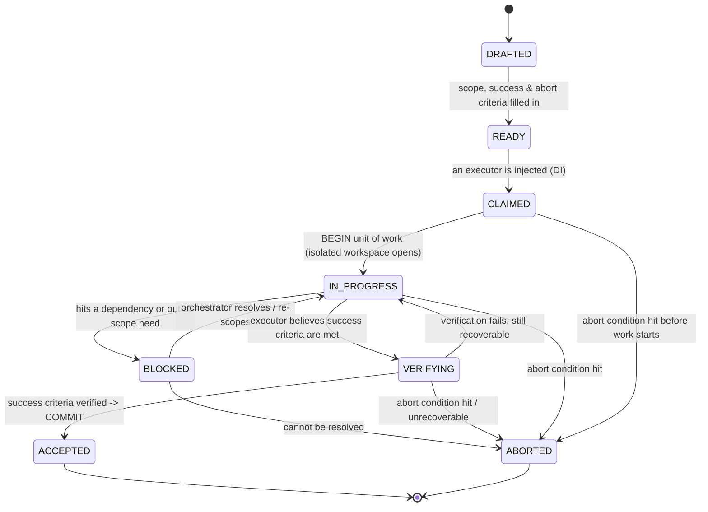

# Contract Lifecycle — a Finite-State Machine

A contract is not just a document; it moves through a small set of well-defined
**states**. Every transition has a **trigger** (what causes it) and, where relevant, a
**guard** (a condition that must hold). Modelling it as a finite-state machine means
there is never ambiguity about "where" a piece of work is — and, critically, exactly
two terminal states: **ACCEPTED** (committed) and **ABORTED** (rolled back).

---

## The diagram



If your renderer doesn't show Mermaid, here is the same machine as plain text:

```
            DRAFTED
               │  (fill scope + success + abort criteria)
               ▼
             READY
               │  (inject an executor — DI)
               ▼
            CLAIMED ───────────────┐
               │  (BEGIN unit       │ abort
               │   of work)         │
               ▼                    ▼
          IN_PROGRESS ──────────► ABORTED ──► [end: ROLLBACK, project untouched]
            │   ▲   │                ▲
   blocked  │   │   │ abort          │
            ▼   │   └────────────────┤
          BLOCKED                    │
            │ resolved               │
            └───► (back to IN_PROGRESS)
               │
               │  (claims success)
               ▼
          VERIFYING ──► ACCEPTED ──► [end: COMMIT, work integrated]
            │   ▲   │
   fail,    │   │   │ abort / unrecoverable
   retry ───┘   │   └────────────────► ABORTED
```

---

## The states

| State | Meaning | Who acts |
|-------|---------|----------|
| **DRAFTED** | The contract exists but isn't complete — missing scope, criteria, or both. | Orchestrator |
| **READY** | Fully specified and safe to hand out. Scope, success criteria, and abort criteria are all present. | Orchestrator |
| **CLAIMED** | An executor has been injected and accepted the contract, but work hasn't begun. | Executor |
| **IN_PROGRESS** | The unit of work is open (isolated workspace). The executor is changing things privately. | Executor |
| **BLOCKED** | The executor cannot proceed without something outside its contract (a dependency, a shared file). It has paused, not improvised. | Executor → Orchestrator |
| **VERIFYING** | The executor believes it's done and is running the contract's verification steps. | Executor |
| **ACCEPTED** *(terminal)* | Success criteria verified. The unit of work is **committed** and integrated. | Orchestrator |
| **ABORTED** *(terminal)* | An abort condition fired or the work proved unrecoverable. The unit of work is **rolled back** — the project is exactly as it was before. | Executor / Orchestrator |

---

## The transitions that matter most

### `READY → CLAIMED` — dependency injection
The orchestrator supplies an executor. This is the only moment "who does it" is
decided, and it touches nothing in the contract itself.

### `CLAIMED → IN_PROGRESS` — `BEGIN`
The unit of work opens an isolated workspace. From here until a terminal state, the
shared project is **not** touched.

### `IN_PROGRESS → BLOCKED` — stop, don't improvise
The single most important rule. If the work needs something outside its declared scope
— a file it isn't allowed to touch, a contract that hasn't finished — the executor
moves to BLOCKED and notifies the orchestrator. It does **not** quietly expand scope.

### `VERIFYING → ACCEPTED` — `COMMIT`
Only after the contract's own verification steps pass. "I think it's done" is not
enough; the contract names how done is proven.

### `* → ABORTED` — `ROLLBACK`
Reachable from CLAIMED, IN_PROGRESS, BLOCKED, and VERIFYING. Whenever an abort
condition fires, the isolated workspace is discarded. Because nothing shared was
touched, rollback is free and total.

---

## Why two terminal states, and only two

A contract that ends any other way ("mostly done", "done but I changed some other
files too", "done but couldn't verify") is precisely the broken-state outcome this
workflow exists to prevent. The machine has exactly two exits so that, at join time,
every contract is either **fully in** (ACCEPTED) or **fully out** (ABORTED) — never
partially anything.
