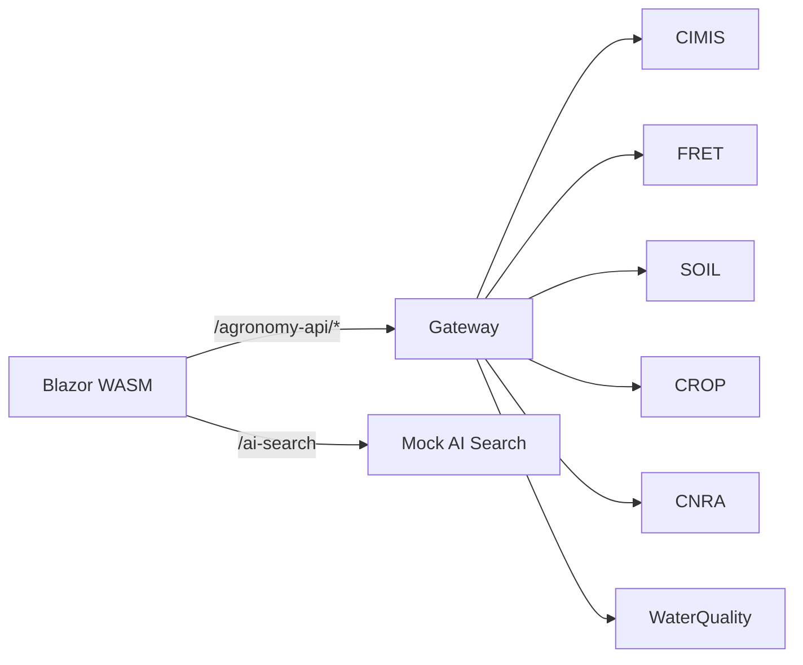

# Two Surfaces, Two Environments

## The frontend's narrow contract

Agronomy Studio is a Blazor WebAssembly app. From the browser's point of view, the entire backend is just **two surfaces**:

1. The **gateway** at `/agronomy-api/*`
2. A **mock AI search** endpoint

That is the whole contract. The frontend never knows that behind the gateway sit a dozen domain services — CIMIS weather, FRET evapotranspiration, soil, crop, CNRA, water quality, and so on. It does not hold twelve base URLs, twelve sets of auth, or twelve retry policies. It holds two.

This is deliberate, and it is what makes the system honest about *where* complexity lives. Complexity belongs in the backend, behind a stable edge that the UI can depend on.

## Two environments, one shape

The second idea is just as important: the same two surfaces exist whether you run the app on your laptop or in production. Only the *mechanism* changes.

- **Local development** uses `tools/mock-apis.mjs`, a small Node server that answers the gateway and AI-search routes.
- **Production** proxies through Netlify redirects to the compiled functions in `netlify/functions/*.mjs`.

The frontend code is byte-for-byte identical across both. It always issues a request to `/agronomy-api/...`; what answers that request differs, but the path and the response shape do not.

This property is called **environment parity**. When the thing you test locally has the same interface as the thing that runs in production, a passing local run is meaningful evidence. When they diverge — different paths, different payload shapes, a real API locally but a mock in CI — you get the classic "works on my machine" failure, where bugs only appear after deploy.

## Why narrowing the surface helps

Imagine the alternative: the Blazor app calls all twelve services directly.

- Every service's base URL, version, and auth scheme leaks into the frontend.
- A change to one service's URL forces a frontend redeploy.
- Local development needs all twelve services reachable, or stubbed one by one.
- Cross-origin (CORS) configuration multiplies across twelve origins.

By collapsing everything to two surfaces, the frontend depends on a *contract*, not on infrastructure. The backend is free to split, merge, rename, or relocate services without the UI noticing — as long as the gateway keeps its promise.

## The takeaway

A backend is "honest" when its boundaries are few, stable, and the same everywhere you run it. Agronomy Studio achieves this with two surfaces and strict dev/prod parity. The rest of this course is about how that parity is maintained in the code.
