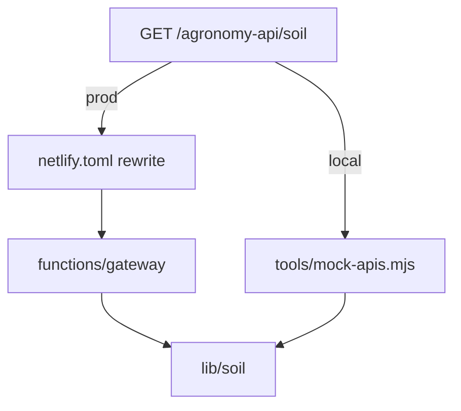

# Routing That Is Identical in Dev and Prod

## A request's journey, end to end

The frontend issues:

```
GET /agronomy-api/soil?lat=36.7&lon=-119.8
```

What happens next depends on the environment — but the path the frontend used never changes. That is the whole point.

### In production: Netlify redirects

`netlify.toml` declares a redirect that maps the public path onto a function:

```toml
[[redirects]]
  from = "/agronomy-api/*"
  to   = "/.netlify/functions/gateway/:splat"
  status = 200
```

A `status = 200` redirect is a **proxy (rewrite)**, not a browser redirect. The browser still sees `/agronomy-api/soil`; Netlify internally forwards the request to the `gateway` function. The `:splat` captures everything matched by the `*`, so `soil?lat=36.7` is preserved and handed to the function.

Inside the gateway, the path tail (`soil`) selects which domain module to dispatch to:

```js
// netlify/lib/gateway.mjs (sketch)
const routes = {
  soil: getSoilProfile,
  crop: getCropData,
  cimis: getCimisStation,
  // ...
};

export async function handleGateway(path, params) {
  const handler = routes[path];
  if (!handler) return notFound(path);
  return handler(params);
}
```

### In local development: the mock server

`tools/mock-apis.mjs` is a small Node server that answers the *same* path, `/agronomy-api/*`. It mirrors the redirect behavior: receive the request, strip the prefix, dispatch by the path tail. Because the frontend always calls `/agronomy-api/...`, you flip from local to production by changing which server is listening — not by changing any frontend code.



## Why mirror the routing instead of hardcoding URLs

A tempting shortcut is to point the frontend at `http://localhost:9000` in dev and at the real domain in prod, using an environment variable. It works, but it quietly breaks parity:

- The dev and prod code paths differ, so a routing bug can hide until deploy.
- CORS behavior differs between a separate localhost origin and a same-origin rewrite.
- The frontend now carries environment knowledge it should not need.

By keeping a single relative path (`/agronomy-api/*`) and making both the mock server and the Netlify rewrite honor it, the routing layer is the *only* thing that differs — and it differs in a way the frontend cannot observe.

## The rule

**Route by relative path; vary only what answers it.** If the public path is stable and both environments dispatch on the same path tail, you can trust that a request which works locally will route the same way in production.
