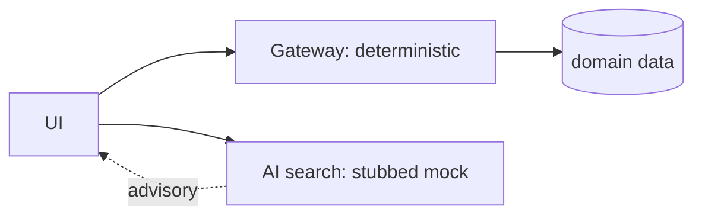

# Keeping AI Off the Deterministic Path

## A deliberately boring AI search

Agronomy Studio's AI search is a **deterministic mock**. The LLM calls are stubbed: given the same input, it returns the same output, every time, with no network call to a model. That sounds like a limitation. It is actually a design decision with real payoff.

The core compute path of the app — fetch weather, compute evapotranspiration, look up soil and crop data, aggregate it through the gateway — is fully deterministic. The same coordinates produce the same numbers. AI sits *beside* that path as an optional convenience (natural-language search), not *inside* it.



## Why determinism at the boundary matters

### 1. Testability

You cannot write a stable assertion against output that changes on every call. A genuine LLM might phrase the same answer five different ways, occasionally hallucinate a field, or time out. If that output were on the compute path, your test suite would be flaky by construction. A deterministic mock lets `npm test` assert exact results:

```js
import { search } from '../netlify/lib/ai-search.mjs';

test('known query returns the canned result', async () => {
  const out = await search('drought tolerant crops');
  expect(out.results.map(r => r.id)).toEqual(['crop-42', 'crop-9']);
});
```

### 2. Trustworthy results

The numbers an agronomist relies on — water requirements, soil suitability — must be reproducible and explainable. A computed value can be traced to its inputs and formula. A model's free-text answer cannot offer the same guarantee. Keeping AI out of the deterministic path means the figures the user acts on never depend on a probabilistic system.

### 3. A clean seam for the future

Because the AI search is just another lib module behind its own surface, swapping the stub for a real model later is a localized change. The contract — input query, structured results — stays put. Nothing in the deterministic gateway path needs to move, and the tests for that path stay green regardless of what the AI does.

## The general principle

Push non-determinism to the **edges** of a system and keep the core reproducible:

- **Deterministic core**: data fetching, validation, computation, aggregation. Tested exactly. Trusted.
- **Non-deterministic edge**: language understanding, suggestion, ranking. Advisory. Fails soft.

When a non-deterministic component fails or behaves oddly, the user loses a convenience, not a correct answer. That is the difference between a system that degrades gracefully and one that becomes untrustworthy the moment the model is having a bad day.

## Bringing the course together

The four ideas reinforce each other. Two narrow surfaces (Lesson 1) give you a small contract to keep stable. Thin wrappers over fat libraries (Lesson 2) make that contract testable. Mirrored routing (Lesson 3) makes local tests predictive of production. And keeping AI deterministic at the boundary (Lesson 4) ensures the results behind that contract are reproducible. Together they describe a small, honest microservices system you can actually trust.
