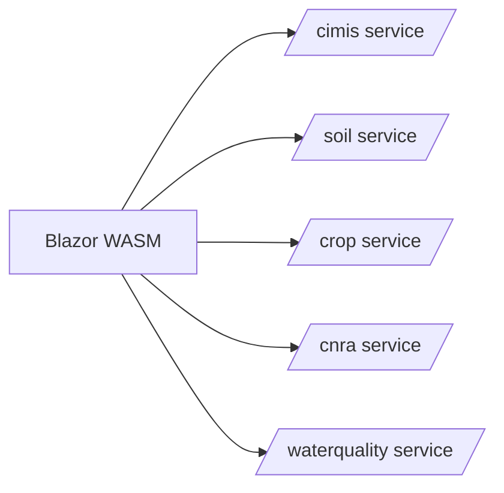
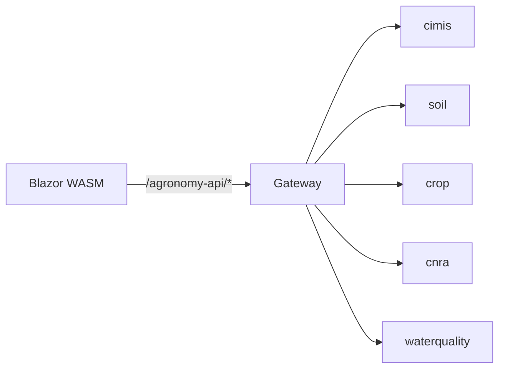

# Why a Gateway: Reducing Coupling and Fan-Out

## The problem a gateway solves

Imagine a frontend that needs weather data, soil data, crop models, and water-quality readings. Without a gateway, the client must know the address of every backend service, the auth scheme of each, and how to retry or fall back when one is down. Every new service the client touches is a new dependency baked into the UI.

This is **fan-out**: one screen calling many endpoints directly.

The coupling is structural. If the soil service moves, splits, or changes its host, the frontend must be rebuilt and redeployed. Cross-cutting concerns — CORS, authentication, rate limiting, logging — get reimplemented in the client for each target.

## One front door

Agronomy Studio inverts this. The Blazor frontend calls exactly one public surface: `/agronomy-api/*` (plus a separate mock AI search endpoint). A **gateway** sits behind that path and routes to the right domain service.

Now the frontend depends on **one contract**, not five. The set of backend services, their hosts, and their internal shapes can change freely as long as the gateway keeps its promise about `/agronomy-api/*`.

## What the gateway buys you

- **Stable client contract.** The UI is written against one base path. Backend topology is an implementation detail.
- **A single place for cross-cutting concerns.** Auth checks, request logging, and error normalization happen once at the door instead of in every service and every caller.
- **Controlled fan-out.** If one screen genuinely needs three datasets, the gateway can fan out *server-side* — closer to the data, on faster internal links — and return a composed result. The browser still makes one call.
- **Decoupled deploys.** You can rename `soil` to `soil-v2` internally without touching the frontend, because the public path never changed.

## The cost

A gateway is not free. It is another component to operate, and a careless gateway becomes a *distributed monolith* — a single chokepoint that every change must pass through. The discipline that keeps it healthy is the subject of the next lesson: the gateway routes and composes; it does not *contain* domain logic.

The rule of thumb: a gateway should be **thin and boring**. The moment business rules start living inside it, you have recentralized the coupling you were trying to remove.
