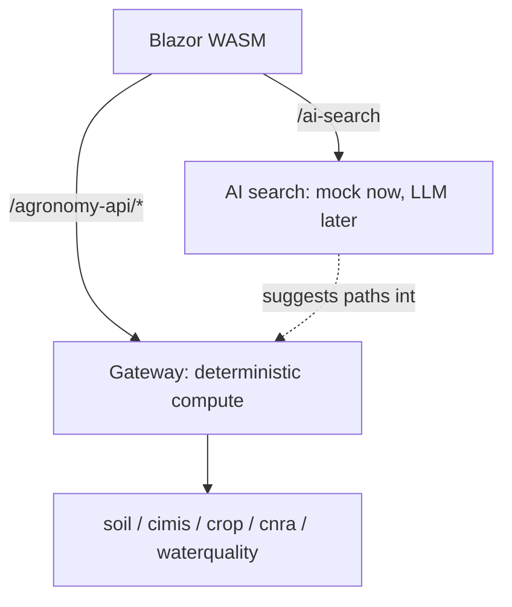

# Keeping AI Out of the Deterministic Compute Path

## Two very different kinds of work

Agronomy Studio does two things that look similar from the UI but are profoundly different underneath:

1. **Deterministic compute.** Given a location, return the soil profile, weather record, or crop coefficient. The same input yields the same output, every time. It can be unit-tested with exact assertions.
2. **AI search.** A natural-language query that *interprets* intent and produces a free-form, probabilistic result.

Mixing these is dangerous. If an LLM sits inside the path that computes a water-quality number, that number becomes non-reproducible, hard to test, slow, and potentially wrong in ways that are difficult to detect.

## The architectural decision

The app keeps AI on a **separate endpoint** (`/ai-search`), distinct from the gateway's `/agronomy-api/*` deterministic surface. The AI search is implemented as a **deterministic mock** — the real LLM call is stubbed.

```typescript
// netlify/lib/ai-search.ts — deterministic mock
export interface SearchResult { title: string; path: string; score: number; }

const INDEX: Record<string, SearchResult[]> = {
  "soil ph": [{ title: "Soil pH by location", path: "/soil", score: 0.98 }],
  "evapotranspiration": [{ title: "CIMIS ET data", path: "/cimis", score: 0.95 }],
};

export function aiSearch(query: string): SearchResult[] {
  const key = query.trim().toLowerCase();
  // deterministic: same query -> same results, no network, no model
  return INDEX[key] ?? [];
}
```

## Why stub the model on purpose

This is not laziness; it is a testing and trust decision:

- **Reproducible tests.** A test can assert `aiSearch("soil ph")` returns a known result. You cannot make that assertion against a live model whose output drifts.
- **No flaky CI.** Tests do not depend on network access, API keys, rate limits, or model availability.
- **A clean seam.** The mock defines the *contract* the real implementation must honor: same function signature, same return type. Swapping in a real LLM later is a localized change behind `aiSearch`.
- **Trustworthy core.** The numbers the app reports come only from the deterministic services. The AI helps users *find* the right deterministic tool; it never *becomes* the source of truth.

## The boundary, drawn



Notice the dashed line: AI can *point at* the deterministic services, but data flows to the user only through the solid, testable path. This is the general principle — **let probabilistic components guide and rank, but keep authoritative computation deterministic and verifiable.**

## When you do add a real model

Keep the seam. The real implementation should still:

- live behind the same `aiSearch` signature,
- be reachable only via the separate `/ai-search` endpoint,
- and never be inserted into a `/agronomy-api/*` handler that returns a factual number.

If you ever need an LLM to summarize results, do it as a clearly-labeled layer *on top of* deterministic data, not woven *into* the calculation.
