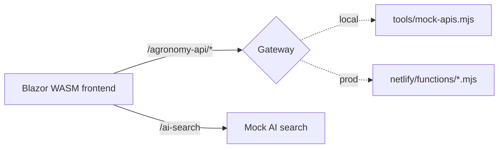

# Dev/Prod Parity: One Frontend, Two Backends That Behave the Same

## The frontend only knows two doors

Agronomy Studio's Blazor WebAssembly frontend talks to exactly two surfaces: the **gateway** at `/agronomy-api/*` and a **mock AI search**. It never names a specific domain service, and — crucially — it never knows whether those paths are served by a local mock or by production Netlify functions.

That indifference is the whole point of *environment parity*. If local development and production diverge, you spend your time debugging the gap between them instead of your actual feature.



## Two implementations of the same contract

In production, `netlify.toml` redirects map the public path onto a function:

```toml
[[redirects]]
  from = "/agronomy-api/*"
  to = "/.netlify/functions/gateway/:splat"
  status = 200
```

Locally, `tools/mock-apis.mjs` stands up a tiny server that answers the *same* paths:

```js
// tools/mock-apis.mjs
import { createServer } from "node:http";
import { handleGateway } from "../netlify/lib/gateway.js";

createServer(async (req, res) => {
  if (req.url.startsWith("/agronomy-api/")) {
    const body = await handleGateway(req.url.replace("/agronomy-api", ""));
    res.setHeader("content-type", "application/json");
    res.end(JSON.stringify(body));
  }
}).listen(8888);
```

The key detail: the mock and the production function **call the same `netlify/lib/gateway` module**. The local server is not a fake reimplementation of the gateway's behavior — it is the real gateway logic wrapped in a different transport. The only thing that differs between dev and prod is the outer shell.

## Why 'the same contract' matters more than 'the same code'

Parity is a property of *observable behavior*, not of identical files. Your contract is: a request to `/agronomy-api/soil?lat=...&lon=...` returns JSON of a known shape. As long as both environments honor that contract, the frontend is portable across them.

This is why reusing the `lib` modules in the mock is so valuable. A hand-written mock that *guesses* the response shape will drift: someone adds a field to the real gateway, forgets the mock, and a feature that works locally breaks in production. By routing both paths through the same module, drift becomes nearly impossible — there is one source of truth for behavior.

## The trade-off you are accepting

Parity is not free. The mock server has to mirror the routing rules in `netlify.toml`, and someone must keep `from`/`to` mappings and the mock's path matching in sync. The discipline is: **redirects and mock routes are two views of one routing table.** When you add `/agronomy-api/crop`, you touch both. Keeping that table small — one gateway entry rather than a dozen per-service entries — is what makes the discipline sustainable.
