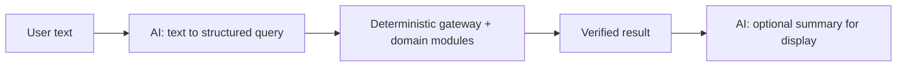

# Determinism at the Boundary: Keeping AI Out of the Compute Path

## A mock that is deliberately not intelligent

Agronomy Studio includes an AI search surface, but in this build it is a **deterministic mock**: given the same query, it returns the same result every time, and the LLM calls are stubbed. That is not a shortcut to be apologized for — it is an architectural decision about where nondeterminism is allowed to live.

## Why determinism matters for testing

A test asserts that some input produces some expected output. A real LLM violates the premise of that sentence: the same prompt can yield different text, different ordering, different confidence. If your core compute path runs through a model, your tests become either flaky or vacuous (asserting almost nothing).

Contrast the two designs:

```ts
// Nondeterministic: the result depends on a model's mood
async function rankFields(query, fields) {
  const answer = await llm.complete(`Rank these fields: ${query}`);
  return parseRanking(answer); // different every run
}

// Deterministic: ranking is computable; AI only suggests the query
function rankFields(query, fields) {
  return [...fields].sort((a, b) => score(b, query) - score(a, query));
}
```

The second version can be tested with a plain assertion. The first cannot, without elaborate snapshotting that tends to mask real regressions.

## Where AI belongs: at the edge, advisory

The useful pattern is to let AI sit **outside** the deterministic core, in an advisory role. A model might turn the user's free text into a structured query, or summarize a result for display. But the data fetching, classification, and aggregation — the parts whose correctness you want to guarantee — stay deterministic.



Because the mock is deterministic, the whole pipeline below the AI edge is testable end to end. You can swap the stub for a real LLM later **without touching the parts you trust**, because the boundary — the structured query the AI must produce — is an explicit contract.

## Trustworthiness, not just convenience

This is also about whether you can stand behind a number you show a grower. If a soil-drainage classification or an irrigation estimate flowed through a language model, you could not honestly claim it was reproducible. By keeping AI out of the compute path, every value the system reports can be traced to deterministic logic and re-derived from the same inputs. The AI makes the system *easier to talk to*; the deterministic core makes the system *worth trusting*.
