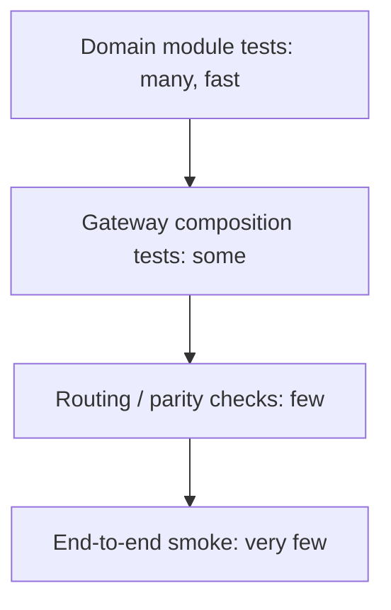

# A Testing Strategy for the Whole System

## Two commands, two questions

Agronomy Studio's backend ships with two cheap checks:

```bash
npm run typecheck   # does the code agree with itself about shapes?
npm test            # does the behavior match expectations?
```

They answer different questions and catch different bugs. Type checking proves that the `SoilResult` your module returns matches what the wrapper serializes and what the frontend expects — without running anything. Tests prove that `classifySoil` actually flags poorly draining soil. Run both; neither subsumes the other.

## A layered test plan that matches the architecture

Because the system is split into modules, wrappers, gateway, and routing, the tests should be layered the same way. Spend your effort where the bugs are most likely and most expensive.



1. **Domain module tests (most of them).** Pure functions with injected fakes, as in Lesson 1. Fast, deterministic, and where the agronomy rules live.
2. **Gateway composition tests.** Verify the gateway calls the right modules and behaves under *partial failure* — if `cimis` is down, does the response degrade gracefully or take the whole request down? Inject failing fakes to force these paths.
3. **Routing / parity checks.** A small test that the public path `/agronomy-api/soil` reaches the soil module, mirroring the `netlify.toml` redirect. This is the one place to catch the dev/prod drift from Lesson 2.
4. **End-to-end smoke (a couple).** Boot `tools/mock-apis.mjs`, hit a real path, assert a real shape. Expensive and slower, so keep them few.

## Testing partial failure deliberately

The gateway's hardest behavior is what happens when a downstream module fails. That behavior never shows up if you only test the happy path. Force it:

```ts
test("gateway degrades when one source fails", async () => {
  const sources = {
    soil: () => ({ series: "Clay-12", drainage: "poor" }),
    cimis: () => { throw new Error("upstream timeout"); },
  };
  const res = await handleGateway("/report?lat=36&lon=-119", sources);
  expect(res.soil).toBeDefined();
  expect(res.cimis).toEqual({ error: "unavailable" }); // degraded, not crashed
});
```

An injected failing source is the cheapest way to prove your error handling exists. If you cannot inject the failure, that is a signal your code is too coupled to test — which loops back to Lesson 1's separation.

## What good looks like

A healthy version of this system has: many tiny module tests, a handful of gateway tests that include failure cases, one or two parity checks tied to the routing table, and a passing `typecheck` that guarantees the shapes line up across the boundary. Together they let you change a domain rule or add a service with confidence that nothing silently broke — locally or in production.
