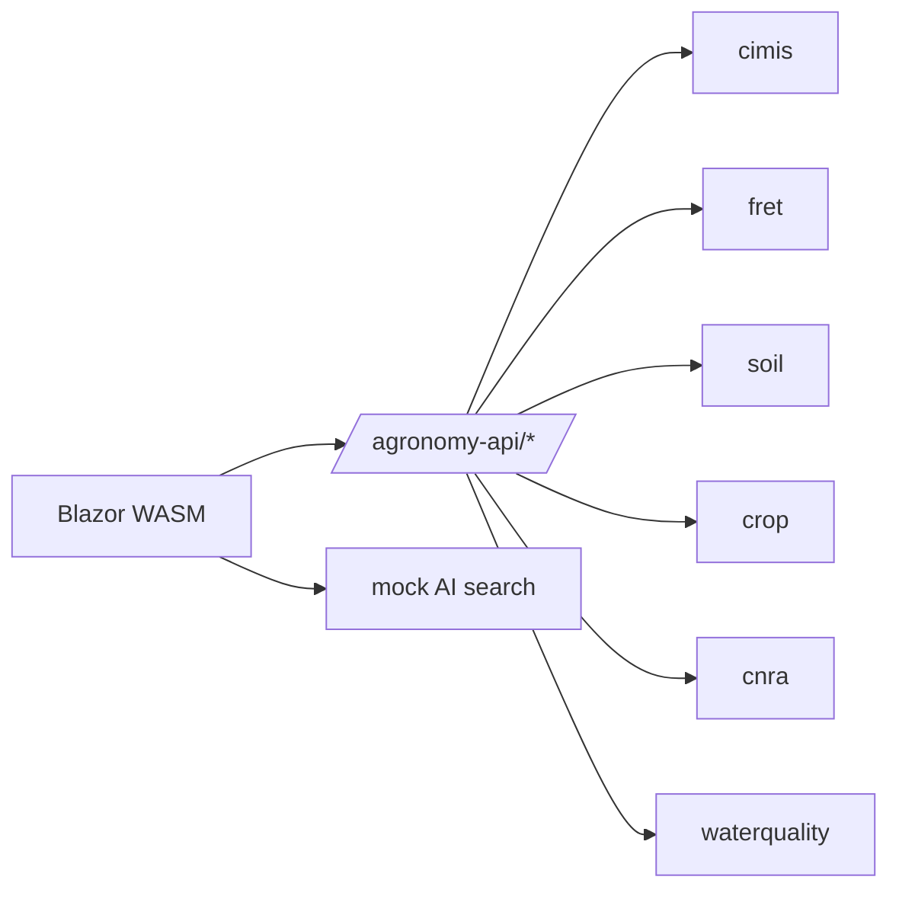

# Two Surfaces, One Test Boundary

## The smallest thing the frontend depends on

Agronomy Studio is a Blazor WebAssembly app sitting on top of roughly a dozen domain services (CIMIS weather, FRET evapotranspiration, soil, crop, CNRA, water quality, and more). But the browser code does not know that. From the frontend's point of view there are exactly **two surfaces**:

1. The **gateway** at `/agronomy-api/*`
2. A **mock AI search** endpoint

That is the entire externally observable contract. Everything else — which domain function answers a request, whether it runs locally or on Netlify, how many services are fanned out behind the scenes — is an implementation detail.

## Why a narrow surface is a testing decision

The number of surfaces a client touches is also the number of things your tests must stand up, stub, or reason about. If the Blazor app called all twelve services directly, every UI test would need twelve fakes, twelve URLs, and twelve failure modes to consider. By collapsing to one gateway plus one AI endpoint, the test surface shrinks to **two**.

This is the practical payoff of the "one front door" pattern, stated in testing terms: a stable, narrow contract is something you can pin down with a small number of fixtures and trust to stay still.

## The contract is what you assert against

Because the frontend only knows two URLs, you can write a contract for each and test both sides against it independently:

- The **frontend** can be tested against a fake gateway that honors the URL shape and response schema.
- The **gateway** can be tested without a browser at all, by calling its handler with synthetic requests.

Neither side needs the other to be running. That decoupling is only possible because the surface was kept deliberately small. A sprawling, ad-hoc set of endpoints would force end-to-end tests for everything.

## What to take away

Deciding what your client is *allowed* to call is a design decision with direct consequences for how testable the system is. Agronomy Studio's two-surface rule is not just architectural tidiness — it is the boundary at which tests are written.
