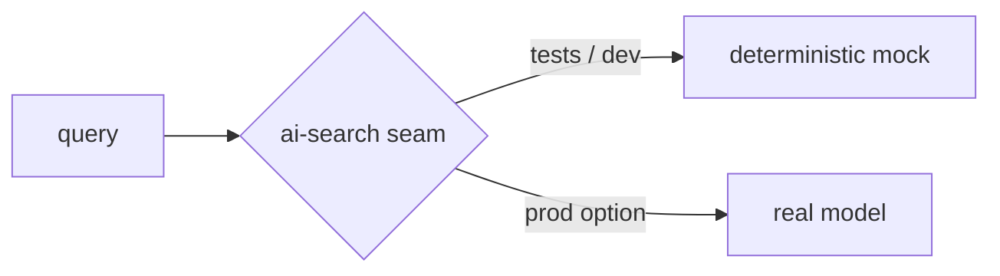

# Deterministic Mocks at the AI Boundary

## A mock that always answers the same way

The AI search in Agronomy Studio is a **deterministic mock**: LLM calls are stubbed out, so a given input always produces the same output. This is not a temporary shortcut — it is a deliberate boundary decision with real consequences for testability.

```ts
// netlify/lib/ai-search.ts (sketch)
export function aiSearch(query: string): SearchResult {
  // No network, no model call: a fixed, rule-based response
  return rankKnownTopics(query);
}
```

## Why non-determinism is poison for tests

A real LLM call is non-deterministic, slow, costs money, and can fail or change behavior when the model is updated. Drop one into the core compute path and your test suite inherits all of that:

- Tests become **flaky** — the same input yields different output across runs.
- Assertions can only be loose ("contains some text"), which catches few regressions.
- CI gets slow and network-dependent, and may incur cost per run.

By keeping the LLM **outside** the deterministic path — stubbed behind a fixed mock — every test that exercises search becomes repeatable. You can assert exact results, run offline, and trust that a failure means the code changed, not that the model had a bad day.

## Determinism is a property you place at a boundary

The key move is putting the AI behind a swappable seam. In tests and local dev, that seam returns canned, rule-based answers. In a future production variant, the same seam could call a real model. Because the boundary is explicit, the *rest* of the system stays deterministic regardless of what sits behind it.



This mirrors a broader principle: keep probabilistic components at the edges and the deterministic core verifiable. The gateway and domain modules can be tested exhaustively because nothing inside them depends on a coin flip.

## Verifying the whole thing

The project's checks reflect this discipline:

```bash
npm run typecheck   # static guarantees on the functions and modules
npm test            # fast, deterministic unit + contract tests
```

Because domain logic is pure (Lesson 2), the surfaces are narrow (Lesson 1), dev and prod share a contract (Lesson 3), and the AI is deterministic (this lesson), `npm test` is a meaningful gate: green means the observable behavior is correct, not merely that nothing crashed.

## What to take away

Keep the unpredictable parts behind an explicit seam and feed tests a deterministic stub. The result is a system whose behavior you can pin down exactly — which is the difference between a test suite that builds trust and one that wastes it.
