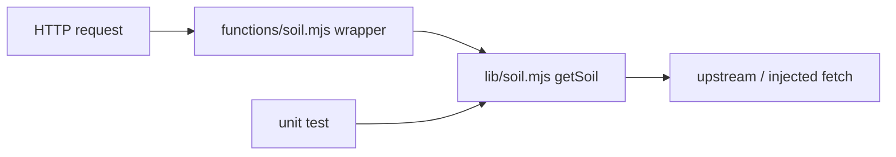

# Thin Handlers, Testable Cores

## Where the logic actually lives

Agronomy Studio splits its backend into two layers:

- `netlify/lib/*` — the **domain modules**: `cimis`, `fret`, `soil`, `crop`, `cnra`, `waterquality`, `gateway`, `ai-search`. These hold the real logic: building requests, parsing upstream responses, composing results.
- `netlify/functions/*` — the **function wrappers**: thin handlers that the platform invokes. They unpack the HTTP request, call into a `lib` module, and pack the result back into an HTTP response.

This is the deployment-wrapper-vs-domain-logic separation, and it exists primarily so the interesting code is *testable without the platform*.

## What a thin wrapper looks like

A function handler should be boring. It translates between the platform's request/response objects and a plain function call:

```js
// netlify/functions/soil.mjs — the wrapper
import { getSoil } from '../lib/soil.mjs';

export default async (req) => {
  const url = new URL(req.url);
  const lat = Number(url.searchParams.get('lat'));
  const lon = Number(url.searchParams.get('lon'));

  const result = await getSoil({ lat, lon });
  return Response.json(result);
};
```

Notice what is *not* here: no soil math, no upstream URL construction, no parsing logic. The handler's only job is the HTTP boundary.

## What a testable core looks like

```js
// netlify/lib/soil.mjs — the domain module
export async function getSoil({ lat, lon }, fetchImpl = fetch) {
  if (!Number.isFinite(lat) || !Number.isFinite(lon)) {
    throw new Error('lat and lon are required');
  }
  const res = await fetchImpl(buildSoilUrl(lat, lon));
  const raw = await res.json();
  return { soilMoisture: raw.vwc, depthCm: raw.depth_cm };
}
```

Because `getSoil` is a plain function that accepts its dependency (`fetchImpl`) as an argument, a test can hand it a fake `fetch` and assert on the mapped output — no HTTP server, no Netlify runtime, no network.

```js
import { getSoil } from '../netlify/lib/soil.mjs';

test('maps upstream fields to the public shape', async () => {
  const fakeFetch = async () => ({ json: async () => ({ vwc: 0.31, depth_cm: 30 }) });
  const out = await getSoil({ lat: 38.5, lon: -121.7 }, fakeFetch);
  expect(out).toEqual({ soilMoisture: 0.31, depthCm: 30 });
});
```

## Why the separation pays off

1. **Tests run in milliseconds** because they call functions, not deployed endpoints.
2. **Logic is reused** — the gateway module can call `getSoil` directly to compose a result, without an internal HTTP round trip.
3. **Wrappers rarely change**, so platform upgrades (a new Netlify handler signature) touch only the thin layer.
4. **Dependency injection** (passing `fetchImpl`) is what makes the core both testable and environment-agnostic — the same idea behind inversion of control.



The test arrow points straight at the core, bypassing the wrapper entirely. That is the design working as intended.
