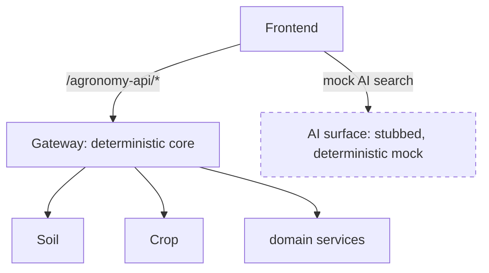

# Deterministic Boundaries: Why the AI Mock Is Predictable on Purpose

## The boundary that would wreck your tests

Most of Agronomy Studio's upstreams are deterministic enough: given the same coordinates, the soil service returns the same shape. The dangerous boundary is the AI search. A real LLM call is **non-deterministic** (the same prompt can return different text), **slow**, **rate-limited**, and **costs money**. If your test suite or your local dev loop depends on it, you inherit all four problems.

Agronomy Studio's answer: the AI search is a **deterministic mock**. The LLM calls are stubbed. Given a query, the mock returns the same structured result every time.

## Determinism is what makes a test an assertion

A test is only meaningful if its expected value is stable. Consider the difference:

```js
// Non-deterministic: you cannot write a real assertion
const answer = await realLlmSearch('drought-tolerant crops for Fresno');
expect(answer).toContain('???'); // what, exactly?

// Deterministic mock: the result is fixed, so the assertion is real
const answer = await aiSearch('drought-tolerant crops for Fresno');
expect(answer.results.map(r => r.cropId)).toEqual(['sorghum', 'safflower']);
```

With the mock, the test pins exact behavior. When the output changes, it changes because *you* changed the mock or the mapping — not because a model felt different today.

## Keep AI out of the deterministic compute path

The deeper principle: the system's core compute path — the gateway fanning out to domain services and composing results — must stay deterministic and verifiable. AI is treated as an *edge feature* sitting outside that path, behind its own surface.



Because AI is a separate surface, you can reason about, test, and trust the core without the LLM's uncertainty leaking into it. The dashed box is intentionally isolated.

## What you gain

- **Testability:** the whole backend can be exercised offline with stable expectations.
- **Trustworthy results:** the data the agronomist sees from the core path is reproducible and auditable; it does not silently drift.
- **Cheap iteration:** no quota, no latency, no key management during development.
- **A clean upgrade path:** when you later wire in a real model, you swap the stub for an implementation that satisfies the same interface — and the deterministic mock stays as your test double.

## The honest caveat

A deterministic mock does not test the real model's quality. It tests that *your system handles the model's contract correctly* — request shaping, response parsing, error handling, and UI rendering. Evaluating the model itself is a different activity (closer to the probabilistic verification work covered elsewhere in the catalog), and it belongs in its own suite, not in your fast unit loop.
