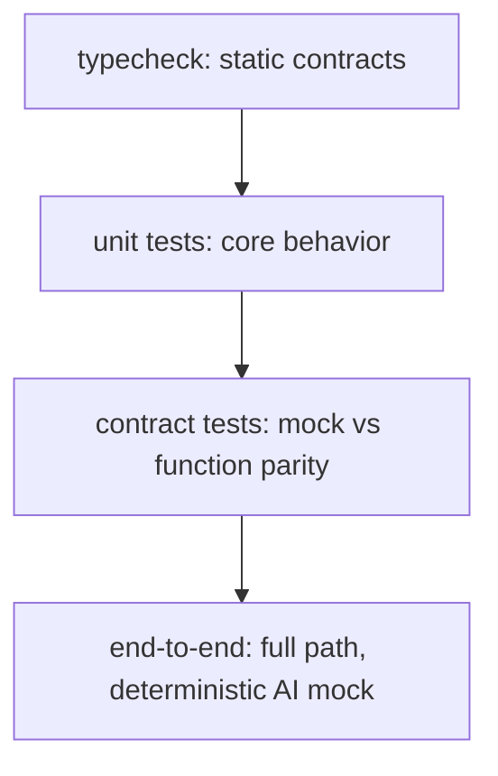

# The Test Loop: Typecheck, Unit Tests, and Contract Checks

## Two commands that guard the backend

Agronomy Studio's functions are exercised by two gates:

```bash
npm run typecheck   # static: do the types agree?
npm test            # dynamic: does the behavior match?
```

These catch different classes of bug, and you want both. The typecheck is fast and catches whole categories of mistakes before a single test runs; the test suite confirms runtime behavior.

## Typecheck: the cheapest bug-finder

In a system where many modules pass structured objects around, a renamed field is a classic silent break. Static typing turns that into a compile-time error:

```ts
interface SoilResult {
  soilMoisture: number;
  depthCm: number;
}

// If the gateway reads result.moisture, typecheck fails immediately —
// you don't wait for a runtime undefined to surface in the UI.
const summary = `Moisture: ${result.moisture}`; // ❌ Property 'moisture' does not exist
```

Because the gateway composes results from several domain modules, the type of each module's output is effectively part of the internal contract. `npm run typecheck` verifies those contracts hold across the whole codebase without executing anything.

## Unit tests: behavior at the core

From the testable-core design in Lesson 2, unit tests target `netlify/lib/*` functions directly with injected fakes:

```js
test('getSoil rejects missing coordinates', async () => {
  await expect(getSoil({ lat: NaN, lon: NaN })).rejects.toThrow('lat and lon');
});
```

These are the tests that run in milliseconds and form the bulk of your suite.

## Contract tests: keeping mock and function in agreement

Lesson 1 warned that the local mock and the production function can drift. A small set of **contract tests** asserts that both producers honor the same schema. The cleanest approach is to validate every response — from either source — against one shared schema:

```js
import { soilSchema } from '../lib/soil.schema.mjs';

function assertSoilShape(payload) {
  const result = soilSchema.safeParse(payload);
  expect(result.success).toBe(true);
}

// Run the same assertion against the mock's output AND the function's output
assertSoilShape(await mockSoilResponse());
assertSoilShape(await getSoil({ lat: 38.5, lon: -121.7 }, fakeFetch));
```

If you add a field to the function but forget the mock, the contract test fails — and you find the parity break in CI instead of in the UI.

## A layered strategy



Each layer is cheaper and faster than the one below it catches the most bugs per second of runtime. Run typecheck and unit tests on every save; run the heavier layers before merge. Because the AI boundary is a deterministic mock (Lesson 3), even the end-to-end layer stays stable and offline.

## The payoff

The architecture and the test strategy reinforce each other: thin wrappers keep the platform out of your tests, testable cores make unit tests trivial, a shared schema makes parity checkable, and a deterministic AI boundary keeps the whole thing reproducible. None of these tricks is exotic — together they let a one-person project credibly maintain a dozen-service backend.
